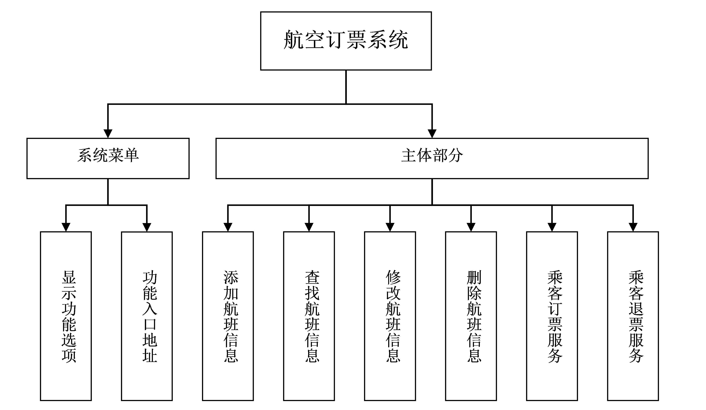

# Plane-booking

## 🚀 介绍
这是一个用C语言简单实现的飞机订票系统，它模拟了飞机订票过程中常用到的逻辑操作。比如订票，取消机票，多人同时订票和多人同时取消机票，航班票数检测，剩余票数提醒。该系统是自己一学期C语言学习的总结成果物。它的实现用到的C语言中常用到的数据结构，体现了基本的算法逻辑。
主要功能结构图如下： 

## 📥如何启动
1. 下载C的IDE，比如devC++就是一个不错的轻量级的编译器
2. 打开main.cpp, 编译，链接，运行
3. 在命令行窗口就可以进行飞机票增删改查的操作了